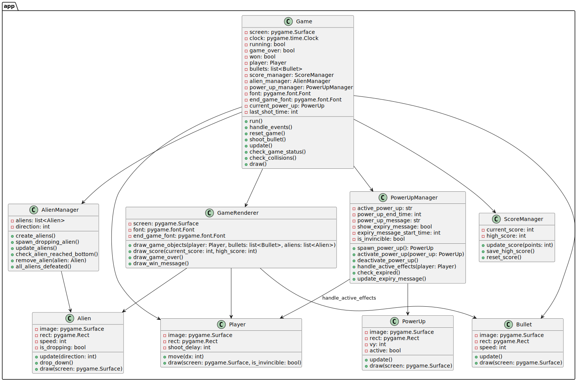

# Arcade Game

An arcade-style game built with Python, Pygame, and managed using Poetry. This game includes features like power-ups, dropping aliens, and a scoring system.

## Table of Contents
- [Installation](#installation)
- [Running the Game](#running-the-game)
- [Building the Game as a Standalone Executable](#building-the-game-as-a-standalone-executable)
- [Makefile Build Commands](#makefile-build-commands)
- [Distribution](#distribution)
- [Troubleshooting](#troubleshooting)

---

## Installation

### Prerequisites
- Python 3.11 (or compatible version)
- Poetry (for dependency management)

### Clone the Repository
Clone this repository to your local machine:
```bash
git clone git@github.com:tikarammardi/arcade-game.git
cd arcade-game
```

### Install Dependencies
Use Poetry to install all necessary dependencies:
```bash
poetry install
```

---

## Running the Game

To start the game locally:
1. Activate the virtual environment:
   ```bash
   poetry shell
   ```
2. Run the game:
   ```bash
   poetry run python app/game.py
   ```

---

## Building the Game as a Standalone Executable

To create a standalone executable, we use PyInstaller, managed via Poetry.

### Step 1: Ensure PyInstaller Compatibility
Add `pyinstaller` to the development dependencies in `pyproject.toml`:

```toml
[tool.poetry.dev-dependencies]
pyinstaller = { version = "^6.11.0", python = ">=3.8,<3.14" }
```

### Step 2: Build the Executable with Makefile
A `Makefile` is provided to automate the build process.

Run the following command to clean any previous builds, install `pyinstaller`, and package the game with all necessary assets:

```bash
make build
```

After running this command, the executable (`ArcadeGame` or `ArcadeGame.exe` on Windows) will be created in the `dist/` directory.

---

## Makefile Build Commands

- **`make all`**: Cleans up previous builds and then builds the executable.
- **`make clean`**: Removes all build artifacts (`build/`, `dist/`, `.spec` files).
- **`make build`**: Builds the executable using PyInstaller, including assets in the final package.
- **`make help`**: Shows a list of available Makefile commands.

---

## Distribution

After building, you can share the standalone executable located in the `dist/` directory. This file contains all dependencies, so users won’t need to install Python or any other packages.

### Running the Executable

1. Navigate to the `dist` directory:
   ```bash
   cd dist
   ```
2. Run the executable:
    - On Linux/macOS:
      ```bash
      ./ArcadeGame
      ```
    - On Windows:
      ```bash
      ArcadeGame.exe
      ```

---

## Troubleshooting

### PyInstaller Compatibility Issues
If you encounter Python compatibility issues with `pyinstaller`, ensure your `pyproject.toml` restricts `pyinstaller` to versions `<3.14` as shown above.

### Missing Assets in Executable
If assets (e.g., images or sounds) aren’t loading in the executable:
1. Confirm that asset paths are correctly specified in the `--add-data` option within the `Makefile`.
2. Verify that assets are being referenced correctly in the code (using relative paths, if needed).

---
### Diagrams
[](https://github.com/tikarammardi/arcade-game)

## Features

### Completed Features
- [x] Player Movement and Controls
- [x] Shooting Mechanism (Bullets)
- [x] Alien Spawning and Movement
- [x] Dropping Aliens (Vertical Alien Movement)
- [x] Score Tracking and High Score Saving
- [x] Power-Ups System
   - [x] Rapid Fire Power-Up
   - [x] Invincibility Power-Up
- [x] Game Over Logic
   - [x] Game Over on Alien Reaching Danger Zone
   - [x] Game Over on Dropping Alien Collision
- [x] Game Rendering
- [x] Sound Effects for Actions (Shooting, Alien Destruction, Power-Ups)
- [x] Standalone Executable Build Script (with `Makefile` and `pyinstaller`)
- [x] Settings Configuration

### Planned Features (To-Do)
- [ ] Enhanced Power-Ups
   - [ ] Speed Boost Power-Up
   - [ ] Multi-Shot Power-Up
   - [ ] Shield Power-Up
- [ ] Level Progression
   - [ ] Increasing Difficulty with Levels
   - [ ] Boss Alien with Special Abilities
- [ ] Additional Visual Effects
   - [ ] Alien Explosion Animation
   - [ ] Invincibility Glow Effect
- [ ] Background Music and Additional Sound Effects
   - [ ] Looping Background Music
   - [ ] Unique Sounds for Different Power-Ups and Alien Types
- [ ] Score-Based Rewards
   - [ ] Extra Life on Milestone Scores
   - [ ] Random Power-Up Reward on High Scores
- [ ] High Score Leaderboard
   - [ ] Local High Score List
   - [ ] Online Leaderboard (Future Extension)

---

